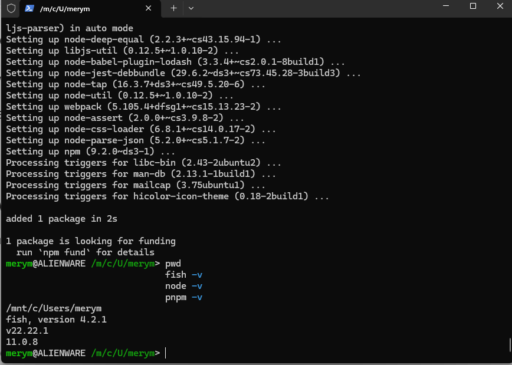

# Actividad 1 - Mary Villca

## Primer Proyecto en Vite

Proyecto creado con Vite + React como parte de la materia Móvil II.

---

## Configuración del entorno

### WSL — Windows Subsystem for Linux

WSL permite ejecutar un entorno Linux directamente en Windows sin necesidad 
de una máquina virtual ni de hacer dual boot. Esto es útil porque muchas 
herramientas de desarrollo están diseñadas para Linux.

**Instalación de WSL:**

```bash
wsl --install
```

Este comando instala automáticamente WSL junto con Ubuntu. 
Una vez instalado, se configura un usuario y contraseña de Linux.

**Versión utilizada:** Ubuntu 24.04 LTS

---

### Fish Shell

Fish (Friendly Interactive Shell) es un tipo de terminal con autocompletado 
inteligente, resaltado de sintaxis y una experiencia más amigable comparado 
con bash o zsh.

**Instalación en Ubuntu/WSL:**

```bash
sudo apt update
sudo apt install fish -y
```

---

### Fisher

Fisher es el gestor de plugins para Fish shell. Permite instalar extensiones 
que agregan funcionalidades extra a la terminal, como soporte para nvm.

**Instalación:**

```bash
curl -sL https://raw.githubusercontent.com/jorgebucaran/fisher/main/functions/fisher.fish | source && fisher install jorgebucaran/fisher
```

---

### NVM — Node Version Manager

NVM permite instalar y cambiar entre distintas versiones de Node.js fácilmente. 
Es útil cuando diferentes proyectos requieren versiones distintas de Node.

**Instalación:**

```bash
curl -o- https://raw.githubusercontent.com/nvm-sh/nvm/v0.40.3/install.sh | bash
```

**Para usarlo desde Fish shell se instala el plugin:**

```bash
fisher install jorgebucaran/nvm.fish
```

---

### Node.js y pnpm

Node.js es el entorno que permite ejecutar JavaScript fuera del navegador. 
pnpm es un gestor de paquetes más rápido y eficiente que npm.

---

## Herramientas verificadas

| Herramienta | Comando | Versión |
|-------------|---------|---------|
| Directorio  | `pwd`   | `/mnt/c/Users/merym/Downloads/MOVIL II/Practica/actividad-1` |
| Fish shell  | `fish -v` | 4.2.1 |
| Fisher      | `fisher -v` | 4.4.8 |
| NVM         | `nvm -v` | 0.40.3 |
| Node.js     | `node -v` | v22.22.1 |
| pnpm        | `pnpm -v` | 11.0.8 |

---

## Captura de terminal



---

## Configuración SSH para GitHub

SSH permite conectarse a GitHub sin necesidad de escribir usuario y contraseña 
cada vez que se sube código.

**Generar llave SSH:**

```bash
ssh-keygen -t rsa -b 4096 -C "correo@gmail.com"
```

**Ver la llave pública para agregarla a GitHub:**

```bash
cat ~/.ssh/id_rsa.pub
```

**Verificar conexión con GitHub:**

```bash
ssh -T git@github.com
```

---

## Crear proyecto con Vite

Vite es una herramienta de construcción moderna que permite crear proyectos 
con React de forma rápida. Genera automáticamente la estructura de carpetas 
y configuraciones necesarias.

```bash
pnpm create vite actividad-1
cd actividad-1
pnpm install
pnpm run dev
```

La aplicación queda disponible en `http://localhost:5173`

---

## Subir proyecto a GitHub

```bash
git init
git add .
git commit -m "feat: actividad 1 - primer proyecto vite"
git remote add origin git@github.com:tu-usuario/actividad-1.git
git push -u origin main
```

---

## Tecnologías utilizadas

- WSL — Ubuntu 24.04 LTS
- Fish Shell 4.2.1
- Fisher 4.4.8
- NVM 0.40.3
- Node.js v22.22.1
- pnpm 11.0.8
- Vite
- Reac


